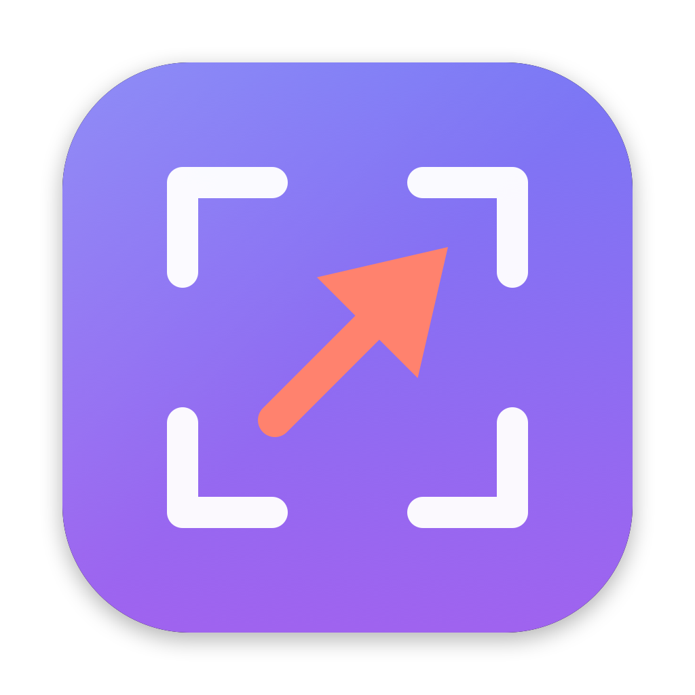

<div align="center">



# ScreenGrabber

A fast, no-friction screenshot grabber + annotator for macOS.

[](https://github.com/sr3d/macos-screengrabber/actions/workflows/ci.yml)
[](https://github.com/sr3d/macos-screengrabber/releases/latest)
[](LICENSE)


</div>

Hit a hotkey, drag a region, mark it up (arrows, rectangles, circles, blur/black-box
masks), then **Copy** straight to the clipboard and paste into Slack — no Finder detour.

It runs as a menu-bar background app (no Dock icon) and reuses the native
`screencapture` crosshair selector, so the region-drag feels exactly like the
built-in ⇧⌘4.

## Download & Install

1. **Download** the latest `ScreenGrabber-*.dmg` from the
   [**Releases**](https://github.com/sr3d/macos-screengrabber/releases/latest) page.
2. **Open the `.dmg`** and drag **ScreenGrabber** into your **Applications** folder.
3. **First launch — get past Gatekeeper.** ScreenGrabber is open-source but not
   signed with a paid Apple Developer ID, so macOS blocks it the first time.
   Pick whichever you prefer:

   - **GUI:** double-click the app, dismiss the warning, then go to
     **System Settings ▸ Privacy & Security**, scroll down, and click
     **"Open Anyway"**. Confirm once.
   - **Terminal (one command):**
     ```bash
     xattr -dr com.apple.quarantine /Applications/ScreenGrabber.app
     ```
     then open the app normally.

> Requires **macOS 13 (Ventura) or later**. The release build is a universal
> binary — it runs natively on both Apple Silicon and Intel Macs.

Prefer to build it yourself? See [Development](#development).

## First-run setup

1. **Launch** ScreenGrabber. A ✂️ scissors icon appears in the menu bar.
2. **Grant Screen Recording.** The first capture triggers the macOS permission
   prompt → enable ScreenGrabber under *System Settings ▸ Privacy & Security ▸
   Screen Recording*, then relaunch the app.
3. **Free up ⇧⌘4 (the hotkey).** macOS owns ⇧⌘4 by default. Turn it off at
   *System Settings ▸ Keyboard ▸ Keyboard Shortcuts ▸ Screenshots* →
   uncheck **"Save picture of selected area as a file"**. ScreenGrabber then
   owns ⇧⌘4. (You can still capture via the menu-bar icon regardless.)

## Use

- Press **⇧⌘4** (or menu-bar icon ▸ *Capture Region*) and drag a region.
- The editor opens. Pick a tool, color, and stroke width in the toolbar:
  - **Arrow / Rect / Circle** — annotate
  - **Blur** — pixelate a region (obscure tokens, emails, faces)
  - **Box** — solid black redaction bar
  - **Text** — click a point and type; **Return** adds a new line, **Esc** or **⌘Return** finishes
- After you draw a shape, the editor drops into **Select** mode automatically so you can adjust it right away.
- **Select** mode — adjust existing shapes:
  - Click a shape to select it; drag its **body to move**, drag a **handle to resize**
    (arrows have two endpoint handles; boxes/circles have eight edge & corner handles).
  - Change the color or stroke width while a shape is selected to restyle it.
  - **Double-click** a text box to re-edit it.
  - **Delete/Backspace** removes the selected shape.
- **Undo** (⌘Z), **Clear**, **Save…** (⌘S, writes PNG), **Copy** (⌘C, to clipboard).
- Paste into Slack with ⌘V.

### Tool shortcuts

| Key | Tool | | Key | Tool |
|-----|------|-|-----|------|
| `1` | Arrow | | `4` | Blur |
| `2` | Rectangle | | `5` | Box |
| `3` | Circle | | `T` | Text |

The **`Aa` dropdown** (next to the tools) sets text size. Color and stroke-width
controls are at the right end of the toolbar.

## Settings (⌘,)

Open from the menu-bar icon ▸ *Settings…* (or **⌘,** in the editor):

- **Save location** — defaults to the macOS screenshot folder (Desktop unless you've
  changed it); choose any folder, or reset to default.
- **Filename** — defaults to the macOS convention (`Screenshot <date> at <time>.png`);
  customize the prefix.
- **Save automatically on capture** (default **on**) — writes a PNG the moment you
  capture, then updates that same file with your annotations when you close the editor.
  Turn it off if you only want to copy to the clipboard.

## Development

Requires the **Xcode Command Line Tools** (Swift 5.9+). No full Xcode needed for a
local build.

```bash
./build.sh          # compile + assemble + ad-hoc sign ScreenGrabber.app
open ScreenGrabber.app
```

`build.sh` compiles the SwiftPM executable, assembles `ScreenGrabber.app`, copies in
the icon, and ad-hoc signs it (so the Screen Recording permission sticks across
rebuilds). It builds for your host architecture by default; pass `ARCHS` for a
universal binary (needs a full Xcode install):

```bash
ARCHS="arm64 x86_64" ./build.sh
```

### Packaging a `.dmg`

```bash
./package.sh                        # native-arch .dmg
ARCHS="arm64 x86_64" ./package.sh   # universal .dmg (needs full Xcode)
```

Produces `ScreenGrabber-<version>.dmg` with a drag-to-Applications shortcut.

### The app icon

The icon is generated programmatically — no image editor required:

```bash
swift Icon/generate-icon.swift      # regenerates Icon/AppIcon.icns + the master PNG
```

Edit `Icon/generate-icon.swift` to change the design, rerun it, then `./build.sh`.

### Cutting a release

Releases are automated by [`.github/workflows/release.yml`](.github/workflows/release.yml).
Bump `CFBundleShortVersionString` in `Info.plist`, then push a version tag:

```bash
git tag v1.0
git push origin v1.0
```

GitHub Actions builds a universal `.dmg` on a macOS runner and publishes it to a new
GitHub Release with auto-generated notes.

### Layout

| File | Role |
|------|------|
| `Sources/screengrabber/main.swift` | App bootstrap, menu-bar item, ⇧⌘4 wiring, About, auto-save |
| `HotKeyCenter.swift` | Carbon global hotkey (no Accessibility permission needed) |
| `CaptureController.swift` | Runs `screencapture -i`, returns a CGImage |
| `CanvasView.swift` | Drawing surface, annotation model, selection/handles, tool shortcuts, export |
| `EditorWindowController.swift` | Toolbar + canvas window, text size, Save/Copy |
| `Preferences.swift` | Settings (UserDefaults) + PNG writing |
| `PreferencesWindowController.swift` | Settings window |
| `Icon/generate-icon.swift` | Programmatic app-icon generator |

### Changing the hotkey

Edit the `register(keyCode:modifiers:)` call in `main.swift`. Key codes are
Carbon virtual key codes (`kVK_ANSI_*`); modifiers combine `cmdKey`, `shiftKey`,
`optionKey`, `controlKey`.

## License

[MIT](LICENSE) © sr3d
